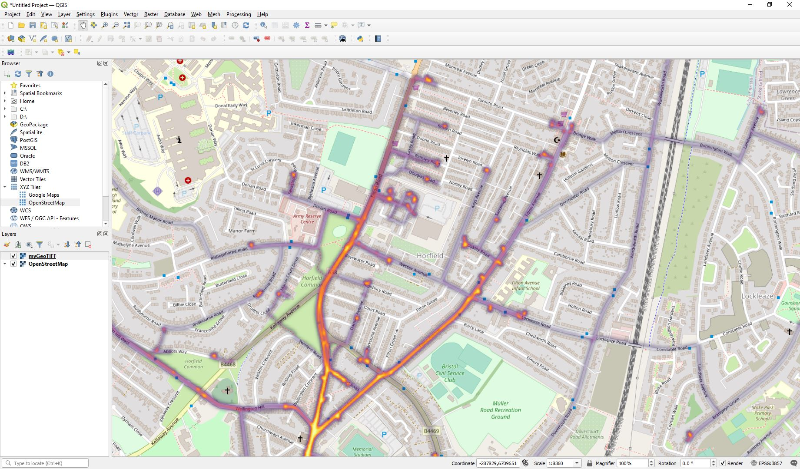
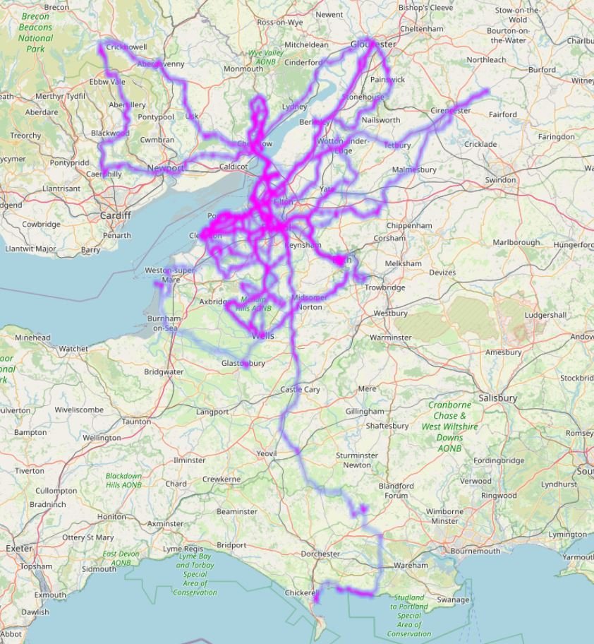
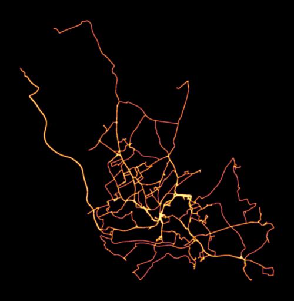
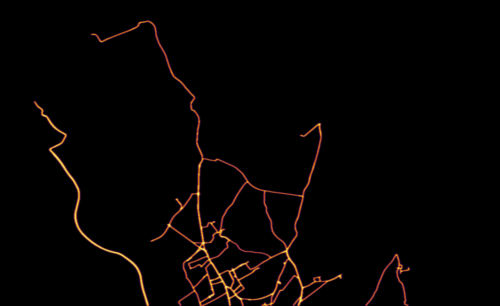
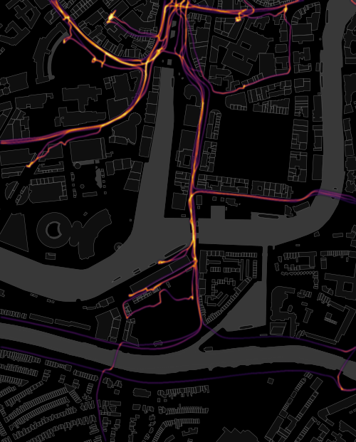
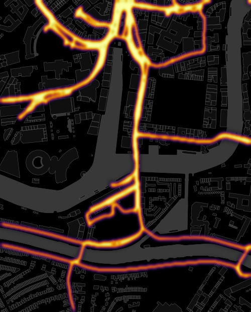
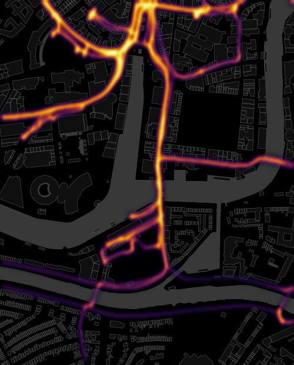
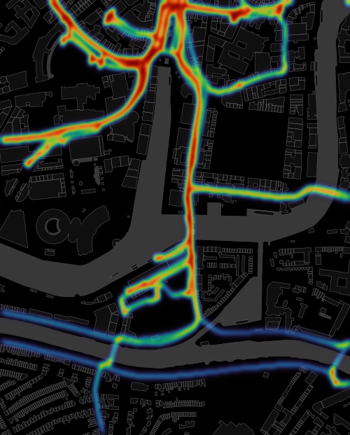
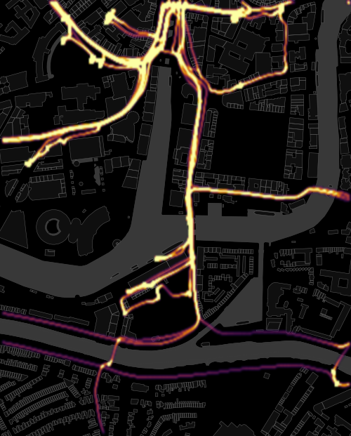
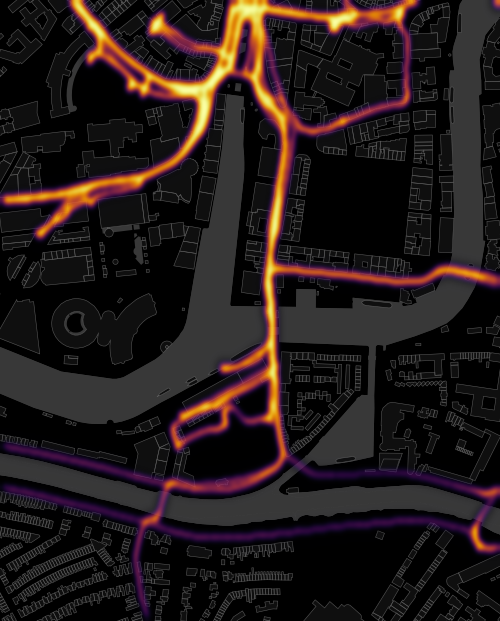

# Heatmap Tool For Multiple Bike Rides

Create and customise your own heatmap about your bike rides.

## Contents

<!-- TOC depthFrom:1 depthTo:6 withLinks:1 updateOnSave:1 orderedList:0 -->

- [Heatmap Tool For Multiple Bike Rides](#heatmap-tool-for-multiple-bike-rides)
	- [Contents](#contents)
	- [Examples](#examples)
	- [Requirements](#requirements)
	- [User Guide](#user-guide)
		- [GPX Files](#gpx-files)
		- [Command Line Arguments](#command-line-arguments)
		- [Background Layers](#background-layers)

<!-- /TOC -->

## Examples

My heatmap of 4 years of Deliveroo cycling with no background.


&nbsp;

My heatmap of 4 years of Deliveroo cycling with building and water layer behind.


&nbsp;

The resulting getagged `.tiff` file can be imported into ArcGIS or QGIS for further analysis or rendering opportunities.



&nbsp;

Other scales are also possible. Below is shown my recreational rides around Bristol.



## Requirements

The python packages can be installed using `pip install -r requirements.txt`.

## User Guide

### GPX Files

The GPX files should be placed in one folder.

Each GPX file sould contain only one GPS track. The frequency of samples in the files should be constant. For best results the sampling frequency should be 1 second.

### Command Line Arguments

The `test_fold` folder is an example folder with a few GPX files to demonstrate the command line argumets of the script.

The `-folder` or `--f` required argument sets the folder which contains the GPX files. It searches all subfolders for GPX files in a recursive fashion too.

The script can be run by simply writing

```
python3 draw.py -f test_fold
```



The extent of the map can be defined by the `--area` or `-a` argument. It expects a formatted string in the form "xmin,ymin,xmax,ymax" where *xmin* is the minimal longitude, *ymin* is the minimal latitude, xmax is the maximal longitude, ymax is the maximal longitude. If any of the four number is not given, it is inferred from the data itself. For example if we want to crop only on the bottom we should run the following command:

```
python3 draw.py -f test_fold -a ,51.464753,,
```



If we want to crop all four sides then run

```
python3 draw.py -f test_fold -a " -2.602665,51.444753,-2.592001,51.453004"
```



> We need the surrounding string and the extra space because the starting coordinate is negative.

How the algorithm works, it divides the geographical area into a grid and places all coordinate samples into the grid cell and counts them. We can change the resolution of of the underlying grid by the argument `--bins` or `-b`. We want to be sure that we get this parameter right because both too large or too small resolution might be unsatisfactory. An example use:

```
python3 draw.py -f test_fold -a " -2.602665,51.444753,-2.592001,51.453004" -b 300
```

<p float="left">


</p>


The next argument is `--limit` or `-l`. When a place is visited way too often than other places it makes all other places dark/invisible. By setting `--limit` lower we can add more colour to less visited places, by increasing it we can emphasise the most visited places. For example

```
python3 draw.py -f test_fold -a " -2.602665,51.444753,-2.592001,51.453004" -b 300 -l 150
```

<p float="left">


</p>

The argument `--colormap` or `-c` can define the color-coding of the heatmap. We use **matplotlib** colourmaps. These can be used in the argument: https://matplotlib.org/stable/tutorials/colors/colormaps.html. For example for black and white coloring one may use

```
python3 draw.py -f test_fold -a " -2.602665,51.444753,-2.592001,51.453004" -b 300 -l 150 -c turbo
```

<p float="left">


</p>

Places visited very few times can seem to disappear from the image. By the `--add_min` or `-m` argument we can add more emphasis to these places, which means we compress the colours a little.

```
python3 draw.py -f test_fold -a " -2.602665,51.444753,-2.592001,51.453004" -b 300 -l 150 -m 50
```

<p float="left">


</p>

There is an opportunity to smoothen the image. This can be achieved by the `-smoothing` or `-s` argument. It expect a non-negative number. 0 means does not perform smoothening. A number *n* means that it will perform smoothening with a kernel of size *2n+1*.

```
python3 draw.py -f test_fold -a " -2.602665,51.444753,-2.592001,51.453004" -b 300 -l 150 -s 0
```

<p float="left">


</p>

Places where we stopped during our activities ca be emphasised by the argument `--emph_stops` or `-e` argument. It expects a postive number, and the bigger this number is the more radical the effect will become.

```
python3 draw.py -f test_fold -a " -2.602665,51.444753,-2.592001,51.453004" -b 300 -l 150 -e 8
```

<p float="left">


</p>

### Background Layers

From the website https://download.geofabrik.de/europe/great-britain/england.html and other websites we can download shapefiles. Put them in the XML file and render it. Make sure the heatmap `.tif` file is interpolated either in bilinear or bicubic manner for best results.
